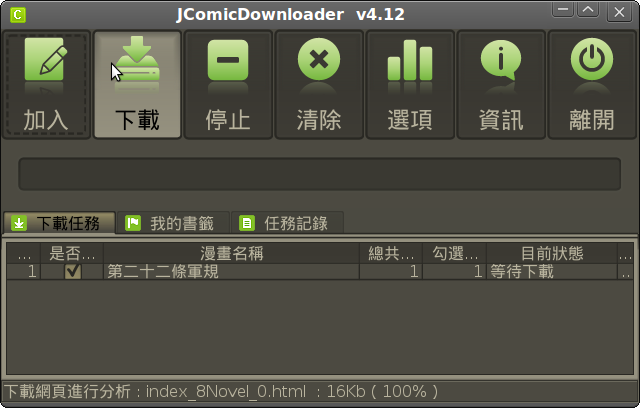

## JComicDownloader

* A tool which has the ability to download the online comics and novels from some china websites.

## Website

* https://sites.google.com/site/jcomicdownloader/

## Platform

* all the platforms with Java Runtime Environment(JRE)

## Release

* https://github.com/abc9070410/JComicDownloader/releases

## Installation

How to build this project
----
*mvn package*

copy JComicDownloader\*.jar and lib at *target* folder

## External Library

* Zhcode
* http://www.mandarintools.com/zhcode.html

* JTatoo
* http://www.jtattoo.net/

* NimROD
* http://nilogonzalez.es/nimrodlf/index-en.html

* Napkin
* http://napkinlaf.sourceforge.net/

* Substance
* https://java.net/projects/substance/

* JAudioTagger
* https://bitbucket.org/ijabz/jaudiotagger/

## Icon Information

- Double-J Design (http://www.doublejdesign.co.uk/)

## License

* GPLv3
* http://www.gnu.org/copyleft/gpl.html
